# 
RollTheDice

### RollTheDice: La Fusión Perfecta entre Juego y Aprendizaje
Bienvenidos a RollTheDice, la app que redefine la educación a través de un enfoque innovador y lúdico. Desarrollada para aquellos que buscan aprender de manera efectiva mientras disfrutan de una experiencia de juego envolvente.

Nuestra aplicación presenta:

✨ <b>Dado del Conocimiento:</b> Lanza el dado y explora la cinco fascinantes categorías de <b>cultura y viajes</b>, <b>gastronomía</b>, <b>mitología</b>, <b>naturaleza</b> y <b>tecnología</b>, desafiando y ampliando tu conocimiento en cada tirada.

🌐 <b>Competencia Global:</b> Conéctate con jugadores de todo el mundo, compite en tiempo real y posiciona tus habilidades en nuestra tabla de récords globales. Una experiencia multijugador que trasciende fronteras.

🏆 <b>Logros y Estadísticas Personalizadas:</b> Mide tu progreso con estadísticas detalladas y desbloquea logros exclusivos. Cada partida es una oportunidad para demostrar tu dominio en diversas áreas.

🚀 <b>Modos de Juego Versátiles:</b> Desde el Modo Única Categoría hasta el desafiante Modo Rápido y muchos más que todavía están por venir.

Ofrecemos una solución única para la formación continua y el desarrollo personal. Descubre cómo RollTheDice puede transformar el tiempo de juego en una inversión educativa.

La aplicación cuenta con distintas <strong>vistas</strong>:

## SPLASH

La pantalla de bienvenida ofrece una entrada dinámica a la app, estableciendo la conexión inicial con los usuarios.

## LOGIN

La pantalla de inicio de sesión proporciona un acceso rápido y seguro a la plataforma, permitiendo a los usuarios gestionar sus perfiles personalizados y acceder a las funciones exclusivas de la aplicación.

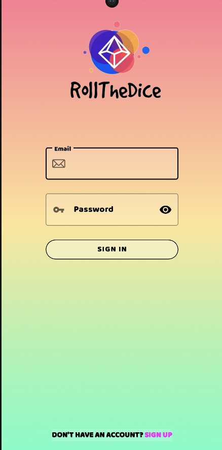

## REGISTER

En la pantalla de registro, los usuarios pueden crear cuentas personalizadas para desbloquear todas las características de la app, estableciendo su identidad dentro de ella.

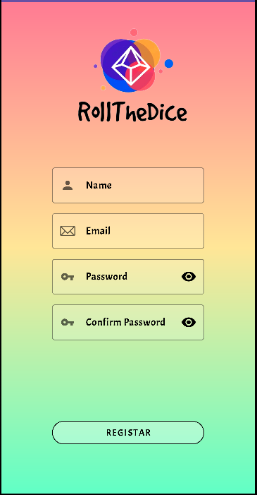

## MENU

La pantalla de menú sirve como centro de comando, ofreciendo opciones para explorar los diversos modos de juego, ajustar configuraciones, ver nuestro prefil y explorar tus records y estadísticas.

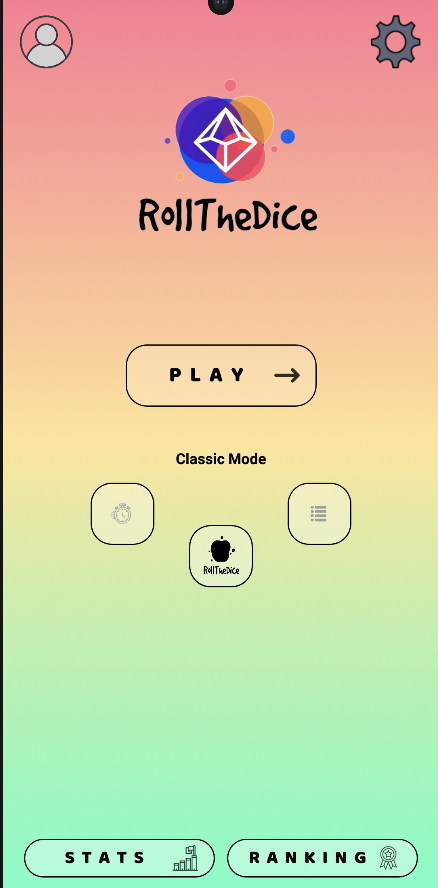

## DADO

La pantalla del dado va a ser la principal parte lúdica, va a disponer de un dado que al deslizar nos va a dar la categoría de la pregunta y nos llevará a ella.

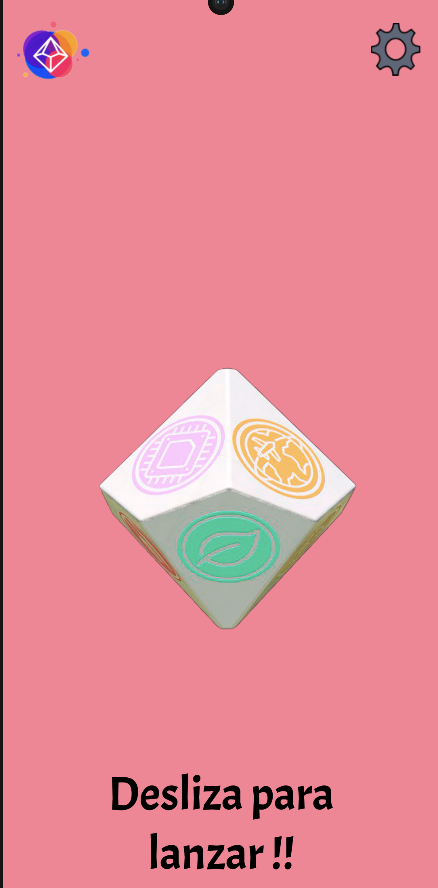

## PERFIL

La pantalla de perfil nos va a permitir a traves de 3 botones cambiar nuestro nombre de usuario, el avatar de perfil o cerrar sesión

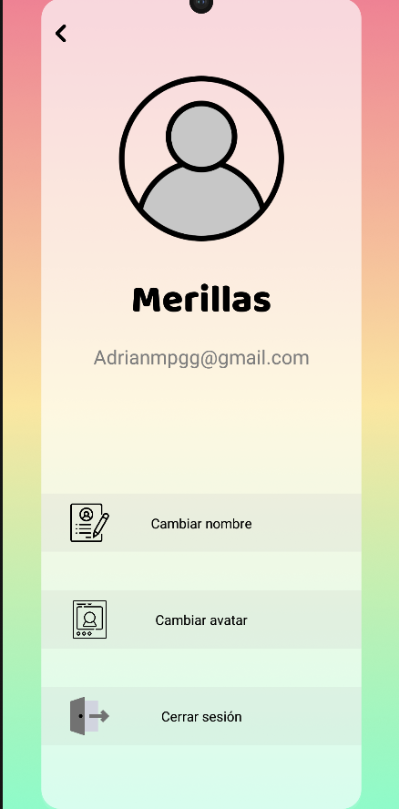

## OPCIONES

La pantalla de opciones nos va a permitir cambiar el volumen de la música, el sonido o el idioma

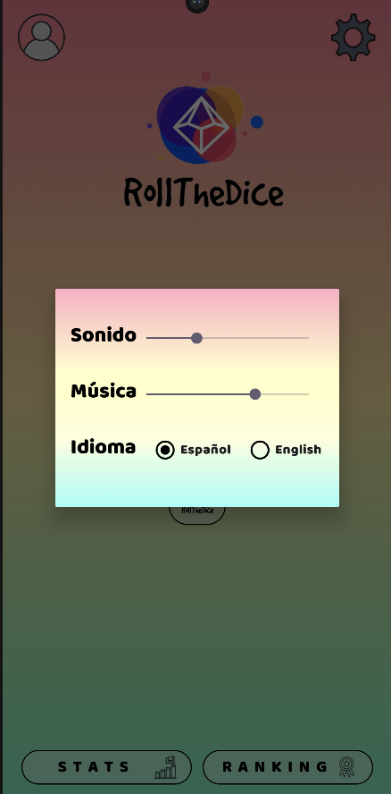

## TRANSICIÓN

Esta pantalla sirve como conector entre el dado y la pregunta, aportando cohexión a la aplicación.

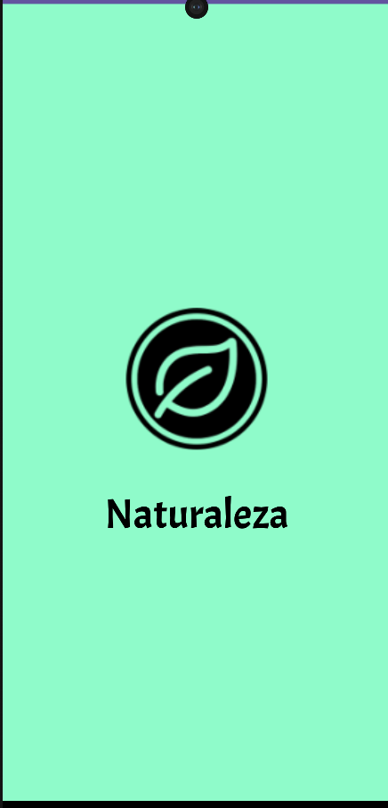

## PREGUNTA

Esta pantalla nos va a dar una pregunta con una imagen asociada a ella y cuatro opciones posibles. Si acertamos, continuaremos jugando y volveremos al dado, si no, acabaremos nuestra partida e iremos a la pantalla de resultados.

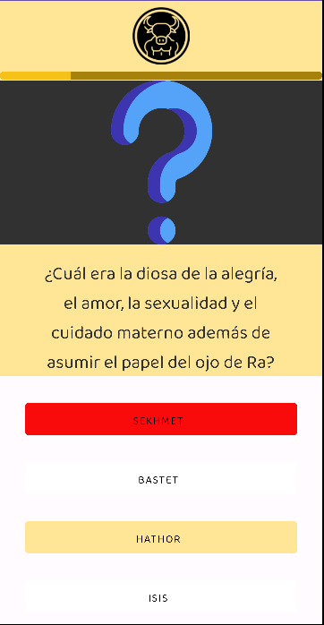

## RESULTADOS

En esta pantalla podremos ver un resumen de nuestra partida con el número de preguntas acertadas y un gráfico de barras donde se mostraran el número de preguntas acertadas dependiendo de la categoría. Tambien vamos a tener la opción a través de dos botones de volver al menu inicial o de iniciar una nueva partida.

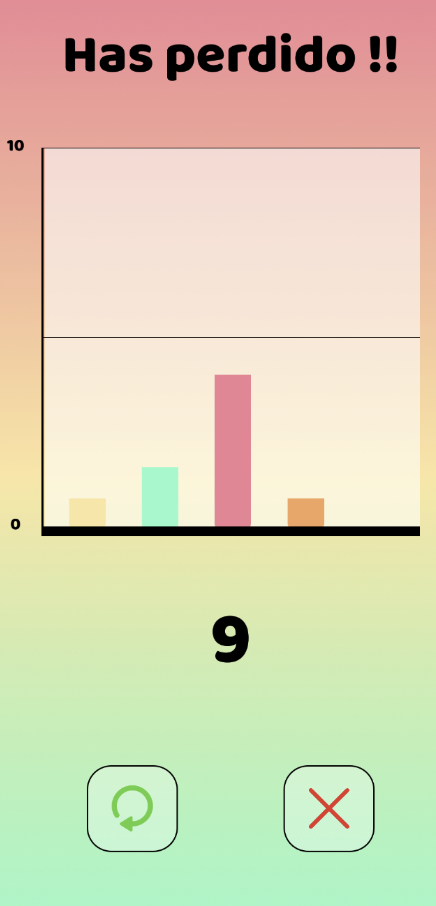

## RANKING

La pantalla de rankings nos va a mostrar una clasificación global con diferentes modalidades como modo clásico, rápido y categoría única donde podremos competir con diferentes usuarios.

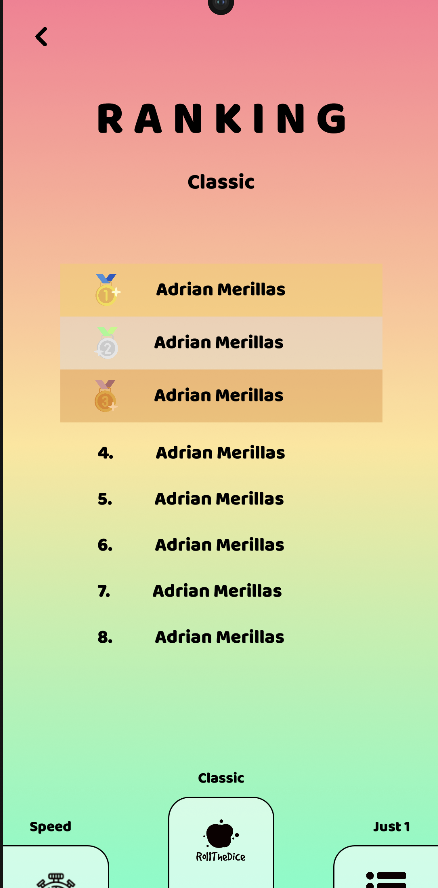

## ESTADISTÍCAS

La pantalla de estadísticas nos va a servir para ver nuestro progreso individual en la aplicación y los diferentes logros con los que probar nuestro conocimiento.

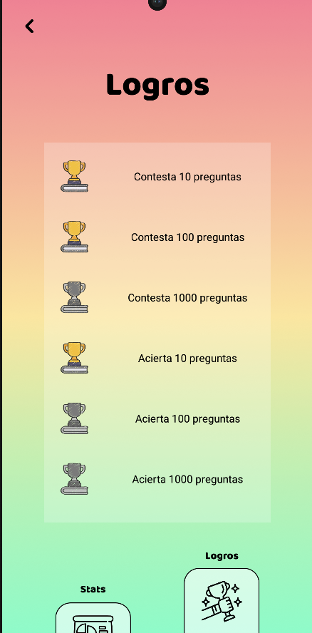

### MANUAL DE USO
https://github.com/Nachiitoo3/RollTheDice/assets/131858630/49005f03-3177-4635-a907-bfacca8d9b72

 
Nuestro prototipo de aplicación esta diseñado en FIGMA es el siguiente:

<a href="https://www.figma.com/file/GePEVWoaB0HHXy5nMlyRQ2/RollTheDice-Prototype?type=design&node-id=1033-18&mode=design&t=njBSW7btAlYHYFmr-0">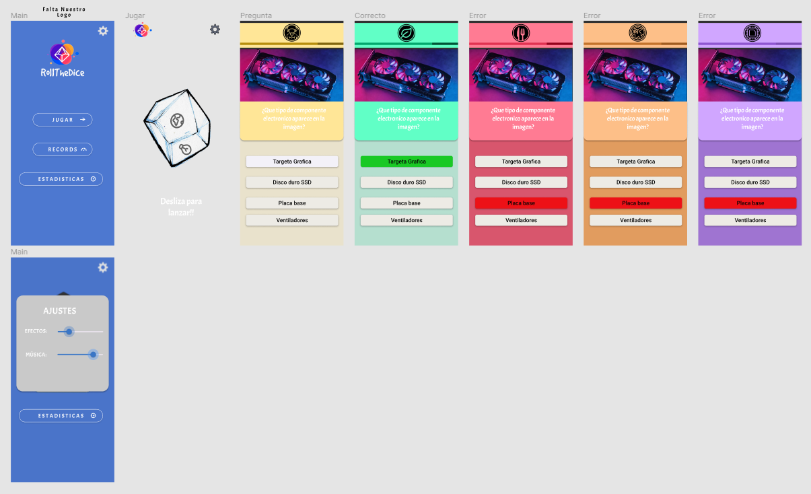</a>

Hecho por Álvaro Guadalupe,Adrián Merillas e Ignacio Ramírez.

